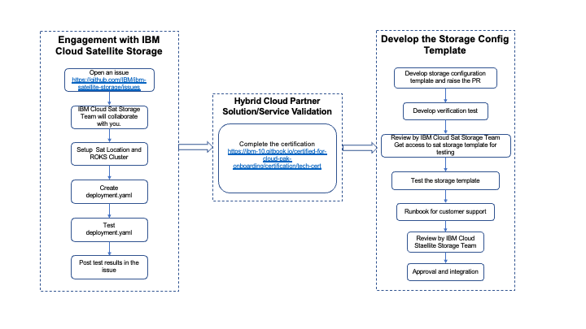

# IBM Cloud Satellite storage
IBM Cloud Satellite Storage provides capabilities to manage the lifecycle of a storage solution on a ROKS cluster deployed in a Satellite Location. It simplifies the storage solution deployment and maintenance including security patches & version upgrades. The core objective is to simplify the storage life cycle management for Cluster Admins by hiding the complexity.

This repository is to collaborate with IBM Partners and Storage Solution Vendors to develop storage configuration templates for IBM Cloud Satellite.

## Overview
With IBM Cloud Satellite, you can bring your own compute infrastructure that is in your on-premises data center, at other cloud providers, or in edge networks as a Satellite Location to IBM Cloud. Then, you use the capabilities of Satellite to run IBM Cloud services on this infrastructure, and consistently deploy, manage, and control your app workloads. For more information, see the IBM documentation.
- [IBM Cloud Satellite](https://www.ibm.com/cloud/satellite)
- [Red Hat OpenShift on IBM Cloud Satellite](https://cloud.ibm.com/docs/satellite?topic=satellite-managed-services)
- [Getting started](https://cloud.ibm.com/docs/satellite?topic=satellite-getting-started)
- [IBM Cloud Satellite Storage](https://cloud.ibm.com/docs/satellite?topic=satellite-sat-storage-template-ov)


## Satellite storage partner certification process
 

## Registering with IBM Cloud

1. [Create an IBMid](https://cloud.ibm.com/registration).

1. Create an issue under [IBM Satellite Storage](https://github.com/IBM/ibm-satellite-storage/issues) repo.
   1. Include the subject line: `<storage-solution-name> integration`*. For example: `LocalVolume integration`. 
   1. Provide a high level description of the storage solution with a link to the user documentation or public repository.

## Setting up your development environment
1. Collaborate with the **`IBM Cloud Satellite Storage Team`** to setup your Satellite Location for development and testing. 

## Testing your storage solution in IBM Cloud Satellite 
1. Create a `deployment.yaml` file to deploy Kubernetes resources for the storage operator or driver in the development environment. Review the following example `deployment.yaml` to deploy the `local-volume` operator.
   ```yaml
   apiVersion: v1
   kind: List
   metadata:
       name: local-storage
       namespace: kube-system
       annotations:
           version: local-storage-45
   items:
     - apiVersion: v1 [1]
       kind: Namespace
       metadata:
           name: local-storage
     - apiVersion: operators.coreos.com/v1alpha2 [2]
       kind: OperatorGroup
       metadata:
           name: local-operator-group
           namespace: local-storage
       spec:
           targetNamespaces:
             - local-storage
     - apiVersion: operators.coreos.com/v1alpha1 [3]
       kind: Subscription
       metadata:
           name: local-storage-operator
           namespace: local-storage
       spec:
           channel: "4.5"
           installPlanApproval: Automatic
           name: local-storage-operator
           source: redhat-operators
           sourceNamespace: openshift-marketplace
     - apiVersion: local.storage.openshift.io/v1 [4]
       kind: LocalVolume
       metadata:
          name: local-disk
          namespace: local-storage
       spec:
           nodeSelector:
               nodeSelectorTerms:
                  - matchExpressions:
                        - key: storage
                          operator: In
                          values:
                              - "localvol"
           storageClassDevices:
               - storageClassName: "localblock-sc"
                 volumeMode: Block
                 devicePaths:
                    - /dev/xvde
   ```
1. Test your deployment.
   1. From `IBM Cloud Console` -> `Satellite` -> `Configurations` -> `Create Configuration`
   1. From `IBM Cloud Console` -> `Satellite` -> `Configurations` -> `Select the Configuration` -> `Add version and upload the deployment yaml`
   1. From the `IBM Cloud Console` -> `Satellite` -> `Configurations` -> `Select the Configuration` -> `Create Subscription`
   1. Verify that the resources are deployment to the cluster. 
   1. Create a PVC and run the sniff test using the IBM Provides test bucket to make sure deployment is working as expected.
 
1. After you have verified your template in the development environment, update the issue. Include the following information in your issue and ensure that you remove any secrets from your files.
   1. Your `deployment.yaml` file.
   1. An example`pvc.yaml` file.
   1. An example `app.yaml`.
   1. The output of the `oc get sc` command that displays the storage classes your deployment creates.
   1. The output of the `oc get -n <namespace> pvc` command that displays the PVCs your deployment creates.
   1. The output of the `oc get -n <namespace> pods` command that displays the pods your deployment creates.


## Solution validation and certification

IBM Team will collaborate with you to ensure your product works well with the IBM Cloud Paks. The intent of this certification is for our two companies to produce enterprise grade, best of breed, resilient, scalable solutions driving toward a consistent and maintainable deployed environment.
1. [Review and complete the certification requirements](https://ibm-10.gitbook.io/certified-for-cloud-pak-onboarding/certification/tech-cert)


## Developing your Satellite storage configuration template

1. Fork this [repository](https://github.com/IBM/ibm-satellite-storage).

1. Convert the `deployment.yaml` to a Satellite storage template. In your fork, make sure that you create your directory structure in the following format. For more information about the template files, review the reference table.
   ```md
   config-templates
   ---<storage-provider-name> 
      ---<storage-offering-name>
         ---<template-version>
               ---deployment.yaml
               ---custom-parameters.json
               ---storage-class-template.yaml
               ---storage-class-parameters.json
               ---metadata.json
               ---README.md
   ```

### File reference

| File name | Description |
| --- | --- |
| `storage-provider-name` | The name of storage provider. Example: `ibm`, `aws`, `azure`, `netapp`, `dell`. |
| `storage-offering-name` | The storage offering name. A provider can have multiple storage offerings for IBM satallite. |
| `template-version` | The template version. There can be multiple tempalte version for a storage offering |
| `deployment.yaml` | A custom Kubernetes `List` that includes the resources like Deployment, StatefulSet, DaemonSet, Configmap, secrets, and storage classes. Example [`deployment.yaml`](https://github.com/IBM/ibm-satellite-storage/blob/master/config-templates/netapp/netapp-trident/20.07/deployment.yaml). |
| `custom-parameters.json` | This file contains the list of parameters that your deployment accepts. Include any required and optional paramters and their default values. Example [`customer-paramerters.json`](https://github.com/IBM/ibm-satellite-storage/blob/master/config-templates/netapp/netapp-trident/20.07/custom-parameters.json). |
| `storage-class-template.yaml` | The storage class template. This template can be used to create storage classes on a Satellite cluster. Example [`storage-class-template.yaml`](https://github.com/IBM/ibm-satellite-storage/blob/master/config-templates/netapp/netapp-trident/20.07/storage-class-template.yaml). |
| `storage-class-parameters.json` | The list of storage class parameters. User / admin can override the values from GUI. The parameter values are injected in storage class template to generate the storage class specifications to deploy on the target clusters. [`storage-class-parameters.json`](https://github.com/IBM/ibm-satellite-storage/blob/master/config-templates/netapp/netapp-trident/20.07/storage-class-parameters.json) |
| `README.md` | Contains prerequisites, deployment steps, and additional information about your template. Copy and fill out the [README_TEMPLATE.md](/.github/README_TEMPLATE.md). |
| `metadata.json` | This file contains the metadata for GUI display. Example [`metadata.json`](https://github.com/IBM/ibm-satellite-storage/blob/master/config-templates/netapp/netapp-trident/20.07/metadata.json). |


### Setting dynamic parameters in your deployment

In this example, the `devicepath` parameter is set dynamically. In a local storage configuration, the device path of the local disks might vary from one cluster to another. To account for this in your configuration template, you can create a dynamic parameter.

1. Parameterize the device path in the template `deployment.yaml` file in the following format. The parameter name `devicepath` is passed in the format: `"{{ <parameter-name> }}"`
   ```yaml
      storageClassDevices:
         - storageClassName: "localblock-sc"
            volumeMode: Block
            devicePaths:
               - "{{ devicepath }}"
   ```

2. Add the parameter to your `custom-parameters.json` file in the following format. You can also include a default value for the parameter.
   ```json
      {
         "description": "A description of the parameter.",
         "displayname": "The display name for the Satellite UI",
         "name": "devicepath",
         "default": "/dev/sdc",
         "regex": "^/dev/[a-zA-Z0-9]+$",
         "max-length": "64",
         "required": "true",
         "category": "config",
         "obfuscate": "false",
         "type": "text"
      }
   ```

#### Custom parameter reference

| Parameter name | Description |
| --- | --- |
| `description` | A description of the parameter. |
| `displayname` | The display name of the parameter that is used in the Satellite UI. |
| `name` | The name of the parameter in string format. |
| `default` | Optional. The default value for the parameter. If the does not specify the parameter in their configuration, this value entered as `default` is used. |
| `regex` | Regular expression to validate the parameter value. |
| `max-length` | Maximum length of the parameter value. |
| `required` | Specify `false` if the parameter is optional otherwise `false`. |
| `category` | Specify `secret` if the parameter is a secret otherwise `config`. |
| `obfuscate` | Set it to `true` if you want to hide the value in GUI or CLI output. |
| `type` | Specify the parameter type. Valid parameter types are: `text`, `boolean`, or `cvs`. |


## Testing and support

1. Once you are ready with your storage configuration template, raise a PR for https://github.com/IBM/ibm-satellite-storage

1. **`IBM Cloud Satellite Storage`** Team will review the PR and provides you the required access to your storage configuration template.

1. Get the list of supported templates
   ```sh
   ibmcloud sat storage template ls
   ```

1. Review your template 
   ```sh
   ibmcloud sat storage template get --name <template-name> --version <template-version> 
   ```

1. Create a configuration using your template. Provide the required parameters as per your template.
   ```sh
   ibmcloud sat storage config create --name <config-name> --location <location-id> --template-name <template-name> --template-version <template-version>  [-p "<parameter>=<value>" -p "<parameter>=<value>"]
   ```

1. Assign your configuration to the cluster.
   ```sh
   ibmcloud sat storage assignment create --name <assignment-name> --group <cluster-group> --configuration <config-name>
   ```

1. Develop test-cases for verification testing. The test-case should include the following:
   * Steps to set up the environment or deploy any prerequisites.
   * Test to verify the functionality of the Storage driver.

1. Provide a runbook for customer support. Include the following information in your support runbook.
   * Support contact details.
   * Link to support site or support ticket process. 
   * Steps to collect data for debugging.
   * Known issues and steps to resolve the issue.
