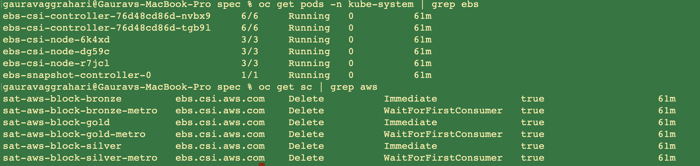

# AWS EBS CSI Driver

AWS EBS CSI driver implements the CSI specification for container orchestrators to manage the lifecycle of Amazon EBS volumes.

**Features supported:**
- Dyanamic Provisioning
- Static Provisioning
- Volume Resizing
- Volume Snapshot

## Prerequisites
**Planning consideration for Infra Admin**
-  For better IOPS and throughput, create a *Nitro System* instance. Refer to
https://docs.aws.amazon.com/AWSEC2/latest/UserGuide/ebs-volume-types.html

**Planning consideration for Location Admin**
- The driver requires IAM permission to manage Amazon EBS volumes. Create an IAM user with proper permission and get your *AWS Access Key*. For more information about how to retrieve your access key, see the [AWS IAM docs](https://docs.aws.amazon.com/IAM/latest/UserGuide/id_credentials_access-keys.html)


## AWS EBS CSI Driver parameters & how to retrieve them

Retrieve all parameters required by this template
```
ibmcloud sat storage template get --name aws-ebs-csi-driver --version 1.1.0
```

**AWS EBS CSI Driver parameters**

| Parameter | Required? | Description | Default value if not provided |
| --- | --- | --- | --- |
| `aws-access-key` | Required | Enter your AWS IAM access key. For more information about how to retrieve your access key, see the [AWS IAM docs](https://docs.aws.amazon.com/IAM/latest/UserGuide/id_credentials_access-keys.html). | N/A |
| `aws-secret-access-key` | Required | Enter your AWS IAM secret access key. For more information about how to retrieve your access key, see the [AWS IAM docs](https://docs.aws.amazon.com/IAM/latest/UserGuide/id_credentials_access-keys.html). | N/A | |


## Default storage classes

| Storage class name | EBS Volume Type | FileSystem Type | default IOPS per GB | Size range | Hard disk | Reclaim policy |
| --- | --- | --- | --- | --- | --- | --- |
| `sat-aws-block-gold` | io2 | ext4 | 10 | 10 GiB - 6.25 TiB | SSD | Delete |
| `sat-aws-block-silver` | gp3 | ext4 | N/A | 1 GiB - 16 TiB | SSD | Delete |
| `sat-aws-block-bronze` | st1 | ext4 | N/A | 125 GiB - 16 TiB | HDD | Delete |


**Note:** Refer [EBS volume types](https://docs.aws.amazon.com/AWSEC2/latest/UserGuide/ebs-volume-types.html) to create additional storageclasses for creating volume with different IOPS.

## Creating the AWS EBS CSI Driver storage configuration

**Example `sat storage config create` command**

```sh
ibmcloud sat storage config create --name aws-ebs-conf --template-name aws-ebs-csi-driver --template-version 1.1.0 -p "aws-access-key=<access-key-without-base64-encoding>" -p "aws-secret-access-key=<secret-access-key-without-base64-encoding>"
```

## Creating the storage assignment

**Example `sat storage assignment create` command**

```sh
ibmcloud sat storage assignment create --name install-ebs --group <cluster-group> --config aws-ebs-conf
```

## Verifying your AWS EBS CSI Driver storage configuration is assigned to your clusters

To verify that your configuration is assigned to your cluster. Verify that the driver pods are running, and list the Satellite storage classes that are installed.

List the EBS driver pods in the `kube-system` namespace and verify that the status is `Running`.

```
% kubectl get pods -n kube-system | grep ebs
ebs-csi-controller-5669b7cf75-8c4pq     6/6     Running   0          4m14s
ebs-csi-controller-5669b7cf75-wxhpl     6/6     Running   0          4m14s
ebs-csi-node-2njh5                      3/3     Running   0          4m14s
ebs-csi-node-5q5vn                      3/3     Running   0          4m14s
ebs-csi-node-pl2qs                      3/3     Running   0          4m14s
ebs-snapshot-controller-0               1/1     Running   0          4m14s
```

List the EBS storage classes.

```
% kubectl get sc| grep ebs
sat-aws-block-bronze      ebs.csi.aws.com    Delete          WaitForFirstConsumer   true                   15m
sat-aws-block-gold        ebs.csi.aws.com    Delete          WaitForFirstConsumer   true                   15m
sat-aws-block-silver      ebs.csi.aws.com    Delete          WaitForFirstConsumer   true                   15m
```

**Example output**



## Troubleshooting


## References

- AWS-EBS-CSI-Driver: https://github.com/kubernetes-sigs/aws-ebs-csi-driver
- Examples: https://github.com/kubernetes-sigs/aws-ebs-csi-driver/tree/master/examples/kubernetes
- Amazon EBS: https://docs.aws.amazon.com/AWSEC2/latest/UserGuide/AmazonEBS.html
- AWS Support: https://console.aws.amazon.com/support/home#/
