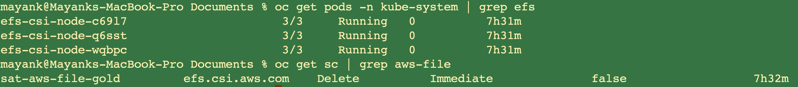

# AWS EFS CSI Driver

AWS EFS CSI driver implements the CSI specification for container orchestrators to manage the lifecycle of Amazon EFS file systems.

## Prerequisites

- Currently only *static provisioning* is supported. This means an [AWS EFS file system](https://docs.aws.amazon.com/efs/latest/ug/gs-step-two-create-efs-resources.html) needs to be created manually on AWS first. After that it can be mounted inside a container as a volume using the driver.

## Default storage classes

| Storage class name | File system | IOPs | Size range | Reclaim policy |
| --- | --- | --- | --- | --- |
| `sat-aws-file-gold` | NFS | NA | NA | Delete | 


## Creating the AWS EFS CSI Driver storage configuration

**Example `sat storage config create` command**

```
ibmcloud sat storage config create --name aws-efs-conf --template-name aws-efs-csi-driver --template-version 1.0.0
```

## Creating the storage assignment

**Example `sat storage assignment create` command**

```
ibmcloud sat storage assignment create --name install-efs --cluster-group <cluster-group> --configuration aws-efs-conf
```

## Verifying your AWS EFS CSI Driver storage configuration is assigned to your clusters

```
$ oc get pods -n kube-system | grep efs    
efs-csi-node-4gkzx                      3/3     Running   0          2d22h
efs-csi-node-r8g5d                      3/3     Running   0          2d22h
efs-csi-node-td4wc                      3/3     Running   0          2d22h
```

```
$ oc get sc | grep aws-file 
sat-aws-file-gold              efs.csi.aws.com    Delete          Immediate              false                  20h
```


**Example output**



## Troubleshooting


## Reference

- AWS-EFS-CSI-Driver: https://github.com/kubernetes-sigs/aws-efs-csi-driver
- Examples: https://github.com/kubernetes-sigs/aws-efs-csi-driver/tree/master/examples/kubernetes
- Amazon EFS: https://docs.aws.amazon.com/efs/latest/ug/whatisefs.html
- AWS Support: https://console.aws.amazon.com/support/home#/