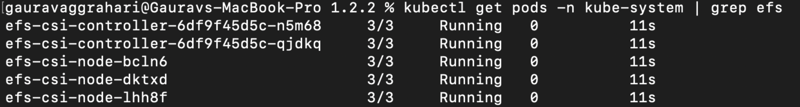

# AWS EFS CSI Driver

AWS EFS CSI driver implements the CSI specification for container orchestrators to manage the lifecycle of Amazon EFS file systems.

# Features Supported:
- Dynamic Provisioning
      aws-efs-csi-driver 1.2.2 supports dynamic provisioning. To make use of dynamic provisining a user defined storage class must be created. While creating the storage class it has the provision to specify GID range which can be useful when providing access to the mounted volume for non-root users.

## Prerequisites

- An [AWS EFS file system](https://docs.aws.amazon.com/efs/latest/ug/gs-step-two-create-efs-resources.html) needs to be created manually on AWS first. After that it can be mounted inside a container as a volume using the driver.
- The driver requires IAM permission to manage Amazon EFS volumes. Create an IAM user with proper permission and get your *AWS Access Key*. For more information about how to retrieve your access key, see the [AWS IAM docs](https://docs.aws.amazon.com/IAM/latest/UserGuide/id_credentials_access-keys.html)
- VPC for EFS and the cluster must be same.
- Subnet used for cluster and EFS must be same.
## AWS EFS CSI Driver parameters & how to retrieve them

```
ibmcloud sat storage template get --name aws-efs-csi-driver --version 1.2.2
```
**AWS EFS CSI Driver parameters**

| Parameter | Required? | Description | Default value if not provided |
| --- | --- | --- | --- |
| `aws-access-key` | Required | Enter your AWS IAM access key. For more information about how to retrieve your access key, see the [AWS IAM docs](https://docs.aws.amazon.com/IAM/latest/UserGuide/id_credentials_access-keys.html). | N/A |
| `aws-secret-access-key` | Required | Enter your AWS IAM secret access key. For more information about how to retrieve your access key, see the [AWS IAM docs](https://docs.aws.amazon.com/IAM/latest/UserGuide/id_credentials_access-keys.html). | N/A | |


## Creating the AWS EFS CSI Driver storage configuration

**Example `sat storage config create` command**

```
ibmcloud sat storage config create --name aws-efs-conf --template-name aws-efs-csi-driver --template-version 1.2.2 -p "aws-access-key=<access-key-without-base64-encoding>" -p "aws-secret-access-key=<secret-access-key-without-base64-encoding>"
```

## Creating the storage assignment

**Example `sat storage assignment create` command**

```
ibmcloud sat storage assignment create --name install-efs --group <cluster-group> --config aws-efs-conf
```

## Verifying your AWS EFS CSI Driver storage configuration is assigned to your clusters
List the EFS driver pods in the `kube-system` namespace and verify that the status is `Running`.
```
% kubectl get pods -n kube-system | grep efs
efs-csi-controller-7d9d467d56-2q5s9     3/3     Running   0          3m36s
efs-csi-controller-7d9d467d56-9gp57     3/3     Running   0          3m36s
efs-csi-node-5t9lv                      3/3     Running   0          3m36s
efs-csi-node-bpj5z                      3/3     Running   0          3m36s
efs-csi-node-nsmqb                      3/3     Running   0          3m36s
```

List the EFS storage classes.

```

**Example output**



**Note**
- For non root user efs-csi-driver 1.2.2 must be used.
## Troubleshooting


## References

- AWS-EFS-CSI-Driver: https://github.com/kubernetes-sigs/aws-efs-csi-driver
- Examples: https://github.com/kubernetes-sigs/aws-efs-csi-driver/tree/master/examples/kubernetes
- Amazon EFS: https://docs.aws.amazon.com/efs/latest/ug/whatisefs.html
- AWS Support: https://console.aws.amazon.com/support/home#/
