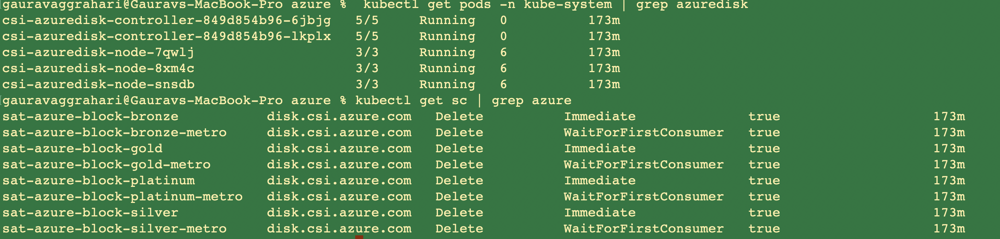

# AZURE DISK CSI Driver[BETA]

AZURE DISK CSI driver implements the CSI specification for container orchestrators to manage the lifecycle of Azure DISK volumes.

**Features supported:**
- Topology(Availability Zone)
    - ZRS disk support(Preview)
- Volume Cloning
- Volume Expansion
- Raw Block Volume
- Shared Disk
- Volume Limits
- fsGroupPolicy

## Prerequisites
- Label the azure worker nodes with proper zone.
    - Run the following commands to label the nodes

    ```
    oc label node <node_name> topology.kubernetes.io/zone-
    oc label node <node_name> topology.kubernetes.io/zone=<zone-value> --overwrite
    ```
    - zone-value is the actual zone where the nodes are created. For example: eastus-1, eastus-2, etc.
- Convert cloud config file to base64 encoded string
    1. create `azure.json` file and fill in all necessary fields, refer to [cloud provider config template](https://github.com/kubernetes-sigs/azuredisk-csi-driver/blob/master/deploy/example/azure.json)
    2. serialize `azure.json` by following command:

    ```
    cat azure.json | base64 | awk '{printf $0}'; echo
    ```


## AZURE DISK CSI Driver parameters & how to retrieve them

Retrieve all parameters required by this template
```
ibmcloud sat storage template get --name azuredisk-csi-driver --version 1.4.0
```

**AZURE DISK CSI Driver parameters**

| Parameter | Required? | Description | Default value if not provided |
| --- | --- | --- | --- |
| `cloud-config` | Required | Enter the serialized value created from azure.json file | N/A |


## Default storage classes

| Storage class name | IOPS range per disk | Size range | Hard disk | Reclaim policy | Volume Binding Mode |
| --- | --- | --- | --- | --- | --- |
| `sat-azure-block-platinum` |  1200 - 160000 | 4 GiB - 64 TiB | SSD | Delete | Immidiate |
| `sat-azure-block-platinum-metro`  | 1200 - 160000 | 4 GiB - 64 TiB | SSD | Delete | WaitForFirstConsumer |
| `sat-azure-block-gold` | 120 - 20000 | 32 GiB - 32 TiB | SSD | Delete | Immidiate |
| `sat-azure-block-gold-metro` | 120 - 20000 | 32 GiB - 32 TiB | SSD | Delete | WaitForFirstConsumer |
| `sat-azure-block-silver`  | 120 - 6000 | NA | SSD | Delete | Immidiate |
| `sat-azure-block-silver-metro` | 120 - 6000 | NA | SSD | Delete | WaitForFirstConsumer |
| `sat-azure-block-bronze`  | 500 - 2000 | 32 GiB - 32 TiB | HDD | Delete | Immidiate |
| `sat-azure-block-bronze-metro` | 500 - 2000 | 32 GiB - 32 TiB | HDD | Delete | WaitForFirstConsumer |


## Creating the AZURE DISK CSI Driver storage configuration

**Example `sat storage config create` command**

```sh
ibmcloud sat storage config create --name <config-name> --template-name azuredisk-csi-driver --template-version 1.4.0 -p "cloud-config=<erialized value created from azure.json file>"
```

## Creating the storage assignment

**Example `sat storage assignment create` command**

**Apply config to a group of clusters**
```sh
ibmcloud sat storage assignment create --name <assignmemt-name> --group <cluster-group> --config <config-name>
```
**Apply config to an individual cluster**
```sh
ibmcloud sat storage assignment create --name <assignmemt-name> --cluster <cluster-id> --config <config-name>
```
## Verifying your AZURE DISK CSI Driver storage configuration is assigned to your clusters

To verify that your configuration is assigned to your cluster. Verify that the driver pods are running, and list the Satellite storage classes that are installed.

List the azuredisk driver pods in the `kube-system` namespace and verify that the status is `Running`.

```
% kubectl get pods -n kube-system | grep azure
csi-azuredisk-controller-849d854b96-6jbjg   5/5     Running   0          167m
csi-azuredisk-controller-849d854b96-lkplx   5/5     Running   0          167m
csi-azuredisk-node-7qwlj                    3/3     Running   6          167m
csi-azuredisk-node-8xm4c                    3/3     Running   6          167m
csi-azuredisk-node-snsdb                    3/3     Running   6          167m
```

List the azuredisk storage classes.

```
% kubectl get sc | grep azure
sat-azure-block-bronze           disk.csi.azure.com   Delete          Immediate              true                   167m
sat-azure-block-bronze-metro     disk.csi.azure.com   Delete          WaitForFirstConsumer   true                   167m
sat-azure-block-gold             disk.csi.azure.com   Delete          Immediate              true                   167m
sat-azure-block-gold-metro       disk.csi.azure.com   Delete          WaitForFirstConsumer   true                   167m
sat-azure-block-platinum         disk.csi.azure.com   Delete          Immediate              true                   167m
sat-azure-block-platinum-metro   disk.csi.azure.com   Delete          WaitForFirstConsumer   true                   167m
sat-azure-block-silver           disk.csi.azure.com   Delete          Immediate              true                   167m
sat-azure-block-silver-metro     disk.csi.azure.com   Delete          WaitForFirstConsumer   true                   167m
```

**Example output**



## Troubleshooting
- In case of node register failure, please make sure that nodes are labelled with proper zone.
- In case of authentication failure, please make sure that **Service Principal** is created properly.

## References
https://github.com/kubernetes-sigs/azuredisk-csi-driver