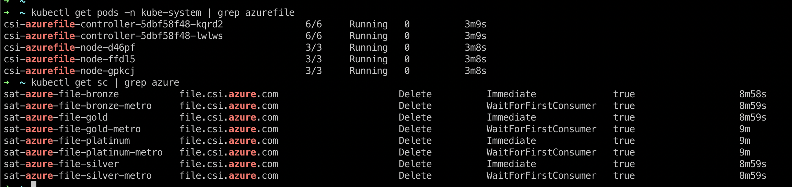

# Azure File CSI Driver [BETA]

The Azure File CSI driver implements the CSI specification for container orchestrators to manage the lifecycle of Azure File volumes.
<!--
**Features supported:**
- Topology(Availability Zone)
- ZRS disk support(Preview)
- Volume Cloning
- Volume Expansion
- Raw Block Volume
- Shared Disk
- Volume Limits
- fsGroupPolicy -->

## Prerequisites
1. Retrieve the zone of your Azure worker nodes.
    ```
    oc get nodes
    ```
2. Label your Azure worker nodes with the zone. Replace `<zone>` with the zone of your Azure worker nodes. For example: `eastus-1`.
    ```
    oc label node <node_name> topology.kubernetes.io/zone-
    oc label node <node_name> topology.kubernetes.io/zone=<zone> --overwrite
    ```


## Azure File CSI Driver parameters & how to retrieve them

Get a list of the Azure template configuration parameters.
```
ibmcloud sat storage template get --name azurefile-csi-driver --version 1.9.0
```

** Azure File CSI Driver parameters**


| Parameter | Required? | Description | 
| --- | --- | --- |
| `tenantId` | Required | The Azure tenant ID that you want to use for your configuration. Follow the Azure documentation to find your [tenant ID](https://docs.microsoft.com/en-us/azure/active-directory/fundamentals/active-directory-how-to-find-tenant){: external}. |
| `subscriptionId` | Required | Your Azure subscription ID. From the Azure portal, search for `Subscription` to find a list of your subscriptions. You can also find this value by running the `az account subscription list` command. |
| `aadClientId` | Required | Your Azure Active Directory Client ID. You can find this value by running the `az identity list` command. |
| `aadClientSecret` | Required | Your Azure Active Directory Client Secret. |
| `resourceGroup` | Required | The name of your Azure resource group. You can find this value by running the `az group list` command. |
| `location` | Required | The location of your Azure hosts. For example `useast` |
| `vmType` | Required | The virtual machine type. You can find this value by running the `az vm list` command. For example: `standard` or `VMSS`. |
| `securityGroupName` | Required | The security group name. You can find this parameters by running the `az network nsg list` command. |
| `vnetName` | Required | The name of the virtual network. You can find this value by running the `az network vnet subnet list` command. |


## Default storage classes

| Storage class name | Reclaim policy | Volume Binding Mode |
| --- | --- | --- |
| `sat-azure-file-platinum`  | Delete | Immediate |
| `sat-azure-file-platinum-metro` | Delete | WaitForFirstConsumer |
| `sat-azure-file-gold` | Delete | Immediate |
| `sat-azure-file-gold-metro` | Delete | WaitForFirstConsumer |
| `sat-azure-file-silver` | Delete | Immediate |
| `sat-azure-file-silver-metro` | Delete | WaitForFirstConsumer |
| `sat-azure-file-bronze` | Delete | Immediate |
| `sat-azure-file-bronze-metro` | Delete | WaitForFirstConsumer |


## Creating the AZURE FILE CSI Driver storage configuration

**Example `sat storage config create` command**

```sh
ibmcloud sat storage config create --name azurefile-test-config \
        --template-name azurefile-csi-driver \
        --template-version 1.9.0 --location <my-location>  \
                                -p "tenantId=$TENANT_ID" \
                                -p "subscriptionId=$SUBSCRIPTION_ID" \
                                -p "aadClientId=$SECRET1" \
                                -p "aadClientSecret=$SECRET2" \
                                -p "resourceGroup=$RESOURCE_GROUP" \
                                -p "location=eastus" \
                                -p "vmType=standard" \
                                -p "securityGroupName=$SECURITY_GROUP_NAME" \
                                -p "vnetName=$VNET_NAME"
```

## Creating the storage assignment

**Example `sat storage assignment create` command**

**Apply config to a group of clusters**
```sh
ibmcloud sat storage assignment create --name <assignmemt-name> --group <cluster-group> --config <config-name>
```
**Apply config to an individual cluster**
```sh
ibmcloud sat storage assignment create --name <assignmemt-name> --cluster <cluster-id> --config <config-name>
```
**Apply config to a service cluster**
```sh
ibmcloud sat storage assignment create --name <assignmemt-name> --service-cluster-id <service-cluster-id> --config <config-name>
```
## Verifying your Azure File CSI Driver storage configuration is assigned to your clusters

To verify that your configuration is assigned to your cluster. Verify that the driver pods are running, and list the Satellite storage classes that are installed.

List the `azurefile` driver pods in the `kube-system` namespace and verify that the status is `Running`.

```
% kubectl get pods -n kube-system | grep azurefile
csi-azurefile-controller-5dbf58f48-kqrd2               6/6     Running   0          3m9s
csi-azurefile-controller-5dbf58f48-lwlws               6/6     Running   0          3m9s
csi-azurefile-node-d46pf                               3/3     Running   0          3m8s
csi-azurefile-node-ffdl5                               3/3     Running   0          3m8s
csi-azurefile-node-gpkcj                               3/3     Running   0          3m8s
```

List the `azurefile` storage classes.

```
% kubectl get sc | grep azure
sat-azure-file-bronze           file.csi.azure.com                      Delete          Immediate              true                   8m58s
sat-azure-file-bronze-metro     file.csi.azure.com                      Delete          WaitForFirstConsumer   true                   8m59s
sat-azure-file-gold             file.csi.azure.com                      Delete          Immediate              true                   8m59s
sat-azure-file-gold-metro       file.csi.azure.com                      Delete          WaitForFirstConsumer   true                   9m
sat-azure-file-platinum         file.csi.azure.com                      Delete          Immediate              true                   9m
sat-azure-file-platinum-metro   file.csi.azure.com                      Delete          WaitForFirstConsumer   true                   9m
sat-azure-file-silver           file.csi.azure.com                      Delete          Immediate              true                   8m59s
sat-azure-file-silver-metro     file.csi.azure.com                      Delete          WaitForFirstConsumer   true                   8m59s
```

**Example output**



## Validate data write
A sample PVC can be created using one of the above storage classes and that PVC can be used on a pod. Take [this as an example](https://github.com/kubernetes-sigs/azurefile-csi-driver/blob/master/deploy/example/deployment.yaml)

```
% kubectl get pods,pvc
NAME                                         READY   STATUS        RESTARTS   AGE
pod/deployment-azurefile4-d44499fdb-tslmg    1/1     Running       0          24h

NAME                                   STATUS        VOLUME                                     CAPACITY   ACCESS MODES   STORAGECLASS                  AGE
persistentvolumeclaim/pvc-azurefile   Bound         pvc-f6ce034d-60da-4970-999f-54aceec11d91   100Gi      RWX            sat-azure-file-bronze         24h
```

the data write can be validated
```
% kubectl exec -it deployment-azurefile4-d44499fdb-tslmg  -- tail -f /mnt/azurefile/outfile
Thu Feb 3 14:39:29 UTC 2022
Thu Feb 3 14:39:30 UTC 2022
Thu Feb 3 14:39:31 UTC 2022
Thu Feb 3 14:39:32 UTC 2022
Thu Feb 3 14:39:33 UTC 2022
...
...
```

<!-- ## Troubleshooting
- In case of `node register failure`, please make sure that nodes are labelled with proper zone.
- In case of `authentication failure`, please make sure that **Service Principal** is created properly. -->

## References
[Azure File CSI Driver](https://github.com/kubernetes-sigs/azurefile-csi-driver)
