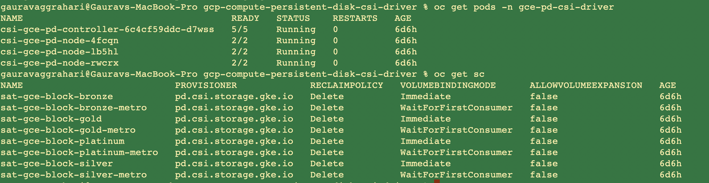

# GCP Compute Persistent Disk CSI Driver

The Google Compute Engine Persistent Disk CSI Driver is a CSI Specification compliant driver used by Container Orchestrators to manage the lifecycle of Google Compute Engine Persistent Disks.

## Prerequisites
- Create a service account in GCP.
- Create a key and download the key in json format.

## GCP Compute Persistent Disk CSI Driver & how to retrieve them

Get a list of the Google Disk template configuration parameters

```
ibmcloud sat storage template get --name gcp-compute-persistent-disk-csi-driver --version 1.0.4
```

** GCP Compute Persistent Disk CSI Driver template parameters **

| Parameter | Required? | Description | Default value if not provided |
| --- | --- | --- | --- |
| `project_id` | Required | Google Cloud Provider Project ID. | N/A |
| `private_key_id` | Required | Google Cloud Provider Private Key ID. | N/A |
| `private_key` | Required | Private Key of the Service Account. | N/A |
| `client_email` | Required | Client Email. | N/A |
| `client_id` | Required | Client ID. | N/A |
| `auth_uri` | Required | Auth URI for the Service Account. | N/A |
| `token_uri` | Required |Token URI for the Service Account. | N/A |
| `auth_provider_x509_cert_url` | Required | URL for the Auth Provider Certificate. | N/A |
| `client_x509_cert_url` | Required | URL for the Client Certificate. | N/A |

## Default storage classes

| Storage class name | Default Read IOPS per GB | Default Write IOPS per GB | Size range (per disk) | Hard disk | Reclaim policy | Volume Binding Mode |
| --- | --- | --- | --- | --- | --- | --- |
| `sat-gce-block-platinum` | NA | NA | 500 GB - 64 TB | SSD | Delete | Immediate |
| `sat-gce-block-platinum-metro`  | NA | NA | 500 GB - 64 TB | SSD | Delete | WaitForFirstConsumer |
| `sat-gce-block-gold` | 30 | 30 | 10 GB - 64 TB | SSD | Delete | Immediate |
| `sat-gce-block-gold-metro` | 30 | 30 | 10 GB - 64 TB | SSD | Delete | WaitForFirstConsumer |
| `sat-gce-block-silver`  | 6 | 30 | 10 GB - 64 GB | SSD | Delete | Immediate |
| `sat-gce-block-silver-metro` | 6 | 6 | 10 GB - 64 GB | SSD | Delete | WaitForFirstConsumer |
| `sat-gce-block-bronze`  | 0.75 | 1.5 | 10 GiB - 64 TiB | HDD | Delete | Immediate |
| `sat-gce-block-bronze-metro` | 0.75 | 1.5 | 10 GiB - 64 TiB | HDD | Delete | WaitForFirstConsumer |


## Creating the GCP Compute Persistent Disk CSI Driver storage configuration

**Example `sat storage config create` command**

```sh
ibmcloud sat storage config create --name <config_name> --template-name gcp-compute-persistent-disk-csi-driver --template-version 1.0.4 --location <location_name> -p "project_id= ****" -p "private_key_id= ****" -p "private_key= **** -p "client_email=****" -p "client_id=******" -p "auth_uri=****" -p "token_uri=****" -p "auth_provider_x509_cert_url=****" -p "client_x509_cert_url=****"
```

## Creating the storage assignment

**Example `sat storage assignment create` command**

**Apply config to an individual cluster**

```sh
ibmcloud sat storage assignment create --name <assignment_name> --cluster <cluster_id> --config <config_name>
```

**Apply config to a group of clusters**
```sh
ibmcloud sat storage assignment create --name <assignment_name> ----group <cluster-group> --config <config_name>
```

**Apply config to a service cluster**

```sh
ibmcloud sat storage assignment create --name <assignment_name> --service-cluster-id <service-cluster-id> --config <config_name>
```

## Verifying yourGCP Compute Persistent Disk CSI Driver storage configuration is assigned to your clusters

List the `gcp-compute-persistent-disk-csi-driver` driver pods in the `kube-system` namespace and verify that the status is `Running`.

```
% kubectl get pods -n kube-system | grep gce
csi-gce-pd-controller-7d89bf967d-92mc8                    5/5     Running             0          14m
csi-gce-pd-node-4d66j                                     2/2     Running             0          14m
csi-gce-pd-node-4mcvr                                     2/2     Running             0          14m
csi-gce-pd-node-8vsmb                                     2/2     Running             0          14m
```
List the `gcp-compute-persistent-disk-csi-driver` storage classes.

```
% kubectl get sc -n kube-system
sat-gce-block-bronze           pd.csi.storage.gke.io   Delete          Immediate              false                  20s
sat-gce-block-bronze-metro     pd.csi.storage.gke.io   Delete          WaitForFirstConsumer   false                  21s
sat-gce-block-gold             pd.csi.storage.gke.io   Delete          Immediate              false                  20s
sat-gce-block-gold-metro       pd.csi.storage.gke.io   Delete          WaitForFirstConsumer   false                  21s
sat-gce-block-platinum         pd.csi.storage.gke.io   Delete          Immediate              false                  19s
sat-gce-block-platinum-metro   pd.csi.storage.gke.io   Delete          WaitForFirstConsumer   false                  20s
sat-gce-block-silver           pd.csi.storage.gke.io   Delete          Immediate              false                  20s
sat-gce-block-silver-metro     pd.csi.storage.gke.io   Delete          WaitForFirstConsumer   false                  21s
```

**Example output**



## References
- [GCP Compute Persistent Disk CSI Driver](https://github.com/kubernetes-sigs/gcp-compute-persistent-disk-csi-driver/tree/v1.0.4)
- [Storage options ](https://cloud.google.com/compute/docs/disks#footnote-1)
