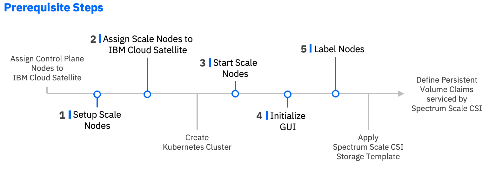
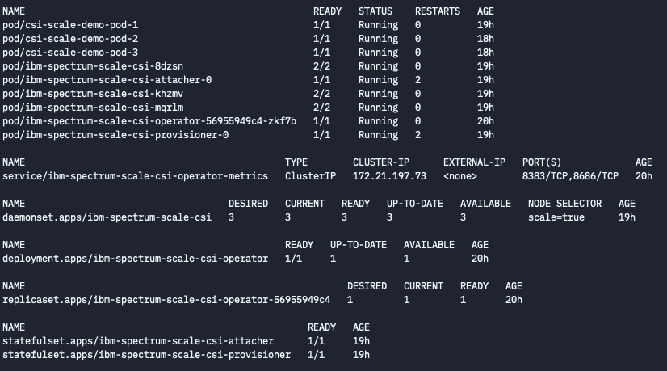

# IBM Spectrum Scale Container Storage Interface Driver

You can use the IBM Spectrum Scale Container Storage Interface (CSI) driver to create persistent storage for stateful applications running in Kubernetes clusters.

The following features are available with IBM Spectrum Scale Container Storage Interface driver:

- **Static provisioning**: Create persistent volumes by using your existing directories and filesets.
- **Lightweight dynamic provisioning**: Create directory-based volumes dynamically.
- **Fileset-based dynamic provisioning**: Create fileset-based volumes dynamically.
- **Multiple file systems**: Create volumes across multiple file systems.
- **Remote volumes**: Create volumes on a remotely mounted file system.
- **Operator deployment**: Deploy, upgrade, and clean up easily by using the IBM Spectrum Scale operator.
- **Multiple volume access modes** Create volumes with ReadWriteMany (RWX) and ReadWriteOnce (RWO) access modes.

## Limitations
The IBM Spectrum Scale management API (GUI) should **NOT** be installed on node managed by Satellite.

## Prerequisites

Complete the following tasks before you start installing the IBM Spectrum Scale Container Storage Interface driver:



### Setup IBM Spectrum Scale Nodes for IBM Cloud Satellite

**Note: Complete the following steps, but do not create an IBM Cloud Spectrum Scale cluster**

1. [Set up IBM Spectrum Scale as root](https://www.ibm.com/support/knowledgecenter/STXKQY_5.1.0/com.ibm.spectrum.scale.v5r10.doc/bl1ins_linsoft.html) and make sure that you install all the required packages by running the following command.
    ```sh
    yum install -y kernel-devel cpp gcc gcc-c++ binutils python3
    ```
2. Follow steps 1-3 of [Installing IBM Spectrum Scale packages on Linux systems](https://www.ibm.com/support/knowledgecenter/STXKQY_5.1.0/com.ibm.spectrum.scale.v5r10.doc/bl1ins_manuallyinstallingonlinux_packages.htm), but make sure that you do not create the cluster in step 4.

3. Follow the steps to [run IBM Spectrum Scale commands without remote root login](https://www.ibm.com/support/knowledgecenter/STXKQY_5.1.0/com.ibm.spectrum.scale.v5r10.doc/bl1adm_sudowrapper.htm), but do not create a Spectrum Scale cluster.
		
4. [Switch to sudo user and create a Spectrum Scale cluster on the worker nodes]((https://www.ibm.com/support/knowledgecenter/STXKQY_5.1.0/com.ibm.spectrum.scale.v5r10.doc/bl1adm_sudowrapper.htm)
    - Verify that the cluster is using sudo wrappers.
    - Verify Spectrum Scale starts up on all worker nodes by running the following commands.
        ```sh
  	sudo /usr/lpp/mmfs/bin/mmstartup -a -- sudo /usr/lpp/mmfs/bin/mmgetstate -a
	```
    - Set up autostart for Spectrum Scale.
	```sh
	sudo /usr/lpp/mmfs/bin/mmchconfig autoload=yes
	```

5. [Attach your IBM Spectrum Scale Nodes to IBM Cloud Satellite](
	- Make sure your system is configured for the desired default route if you have more than one clustering network
	- Make sure that default route has a path to the public network, possibly via NAT or VPN

6. Start IBM Spectrum Scale Nodes and verify that it is running. If there is an issue with the portability layer, you can [rebuild the portability layer](#rebuilding-the-portability-layer).

7. [Mount your file system remotely verify it that is running on all nodes](https://www.ibm.com/support/knowledgecenter/STXKQY_5.1.0/com.ibm.spectrum.scale.v5r10.doc/bl1adv_admrmsec.htm). Run the `mmcluster` command on both the local and remote IBM Spectrum Scale cluster.
8. [Initialize the IBM Spectrum Scale GUI](https://www.ibm.com/support/knowledgecenter/STXKQY_CSI_SHR/com.ibm.spectrum.scale.csi.v2r10.doc/bl1csi_instal_prereq.html).
  
9. Label the worker nodes where the IBM Spectrum Scale client is installed and where IBM Spectrum Scale Container Storage Interface driver is running.
    ```sh
    kubectl label node node1 scale=true --overwrite=true
    ```
  

## IBM Spectrum Scale CSI Driver parameters & how to retrieve them

Run the following command to get a list of parameters for the IBM Spectrum Scale storage template.
	```sh
	ibmcloud sat storage template get --name ess --version 1.1
	```

**ESS CSI Driver parameters**

| Parameter | Required? | Description |
| --- | --- | --- | --- |
| `scale-host-path` | Required | The mount path of the primary file system. You can retrieve this value by running the `mmlsfs` command. |
| `cluster-id` | Required | The cluster ID of the primary IBM Spectrum Scale cluster. You can retrieve this value by running the `mmlscluster` command from a node within the primary cluster. |
| `primary-fs` | Required | The primary file system name. You can retrieve this value by running the `mmlsfs` command. |
| `gui-host` | Required | The FQDN or IP address of the GUI node of the scale cluster that is specified against the id parameter. You can retrieve this value by running the `mmlscluster` command from a node within the primary cluster. |
| `secret-name` | Required | The name of secret that contains the `username` and `password` to connect to primary cluster GUI server.  This parameter is user-specified. |
| `gui-api-user` | Required | The username to connect to primary cluster GUI. To retrieve this value, log-in to the GUI node and run the `lsuser` command. The `gui-api-user` value is in the `CsiAdmin` group. |
| `gui-api-password` | Required | The password to connect to primary cluster GUI. This parameter is user-specified.|
| `k8-n1-ip` | Required | The IP address of Kubernetes Node#1 running IBM Spectrum Scale. You can retrieve this value by running the `oc get nodes` commamd. |
| `sc-n1-host` | Required | Hostname of IBM Spectrum Scale Node#1.  You can retrieve this value by running the `mmlscluster` command from a node within the primary cluster. |
| `k8-n2-ip` | Required | IP address of Kubernetes Node#2 running IBM Spectrum Scale.  You can retrieve this value by running the `oc get nodes` command. |
| `sc-n2-host` | Required | Hostname of IBM Spectrum Scale Node#2. You can retrieve this value by running the `mmlscluster` command from a node within the primary cluster. |
| `k8-n3-ip` | Required | IP address of Kubernetes Node#3 running IBM Spectrum Scale.  Run: `oc get nodes`|
| `sc-n3-host` | Required | Hostname of IBM Spectrum Scale Node#3.  You can retrieve this value by running the `mmlscluster` command from a node within the primary cluster. |
| `storage-class-name` | Required | Name of IBM Spectrum Scale Storage Class.  |
| `vol-backend-fs` | Required | The name of the file system on which the directory-based volume is created. |
| `vol-dir-base-path` | Required | The base path under which all volumes with this storage class is created. The path that you specify must exist before you assign your configuration to your clusters. |

## Creating the IBM Scale CSI Driver storage configuration

**Example `sat storage config create` command**

```sh
ibmcloud sat storage config create --name <config-name> --template-name ess --template-version 1.1 -p "scale-host-path=<scale-host-path>" -p "cluster-id=<cluseter-id>" -p "primary-fs=<primary-fs>" -p "gui-host=<gui-host>" -p "secret-name=<secret-name>" -p "gui-api-user=<gui-api-user>" -p "gui-api-password=<gui-api-password>" -p "k8-n1-ip=<k8-n1-ip>" -p "sc-n1-host=<sc-n1-host>" -p "k8-n2-ip=<k8-n2-ip>" -p "sc-n2-host=<sc-n2-host>" -p "k8-n3-ip=<k8-n3-ip>" -p "sc-n3-host=<sc-n3-host>" -p "storage-class-name=<storage-class-name>" -p "vol-backend-fs=<vol-backend-fs>" -p "vol-dir-base-path=<vol-dir-base>"
```

## Creating the storage assignment

**Example `sat storage assignment create` command**

```sh
ibmcloud sat storage assignment create --name ess --group <cluster-group-name> --config <config-name>
```

## Verifying your storage configuration is assigned to your clusters

To verify that your configuration is assigned to your cluster. Verify that the driver pods are running, and list the Satellite storage classes that are installed.

**Example output**


## Default storage classes

| Storage class name | Type | Reclaim Policy |
| --- | --- | --- |
| `ibm-spectrum-scale-csi-lt` | light weight volumes | Delete  | 

## Troubleshooting

### Rebuilding the portability layer
Run the following commands to rebuild the portability layer on each affected worker. Note that you may need to replace some files and subdirectories.
```sh
sudo yum install -y kernel-devel cpp gcc gcc-c++ binutils python3

sudo mkdir /usr/include/asm
sudo cp /usr/src/kernels/3.10.0-1160.11.1.el7.x86_64/arch/x86/include/uapi/asm/*.h
/usr/include/asm

sudo mkdir /usr/include/asm-generic
sudo cp /usr/src/kernels/3.10.0-1160.11.1.el7.x86_64/include/uapi/asm-generic/*.h
/usr/include/asm-generic

sudo mkdir /usr/include/linux
sudo cp /usr/src/kernels/3.10.0-1160.15.2.el7.x86_64/include/uapi/linux/*.h /usr/include/linux
```

### Changing the mount point if your IBM Spectrum
1. Edit the `ibm-spectrum-scale-csi` daemonset.
    ```sh
    oc edit ds ibm-spectrum-scale-csi -n ibm-spectrum-scale-csi-driver
    ```

2. Search for the `/var\/lib\/kubelet$` string.
    ```sh
    /var\/lib\/kubelet$
    ```
3. Replace the `/var\/lib\/kubelet$` string with `/var/data/kubelet`
    ```sh
    /var/data/kubelet
    ```

    **Example updated daemonset:**
    ```yaml
    volumeMounts:
    ....
    -mountPath: /var/data/kubelet
        name: pods-mount-dir
        ....
    ```

## Mapping IBM Spectrum Scale hosts to Kubernetes node names
In some environments, Kubernetes node names might be different from the IBM Spectrum Scale node names. This results in failure during mounting of pods. Kubernetes node to IBM Spectrum Scale node mapping must be configured to address this condition during the Operator configuration. For more information, see [Kubernetes to IBM Spectrum Scale node mapping](https://www.ibm.com/support/knowledgecenter/STXKQY_CSI_SHR/com.ibm.spectrum.scale.csi.v2r10.doc/bl1csi_config_kubernet_SS_mapping_procedure_final.html).


## Cleaning up your IBM Spectrum Scale deployment
Follow the instructions below to [remove the IBM Spectrum Scale CSI Driver](https://www.ibm.com/support/knowledgecenter/STXKQY_CSI_SHR/com.ibm.spectrum.scale.csi.v2r10.doc/bl1csi_operator.html).

## References

[IBM Spectrum Scale CSI Driver support documentation](https://www.ibm.com/support/knowledgecenter/STXKQY_CSI_SHR/ibmspectrumscalecsi_welcome.html)

